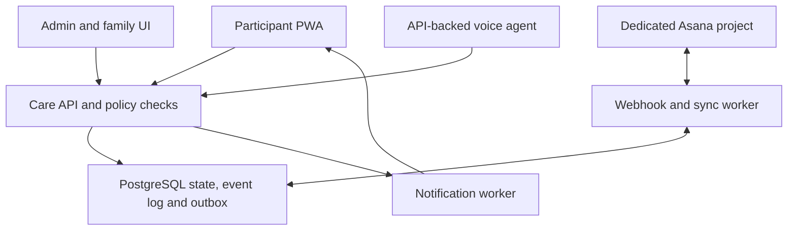

# Companion Rehab — MVP product brief and proposed technical specification

**Current planning authority:** This September 28 brief preserves the original user stories and background. The [implementation roadmap](ROADMAP.md), [canonical JSON](roadmap/roadmap.json) and [October 3 decisions](architecture/PRODUCT_DECISIONS_2026-10-03.md) supersede its earlier sequencing, hosting, role and model assumptions. S01–S04 prioritize Nancy's 10 AM My Day task/meal planning, actual reporting, recovery and repeated check-ins. Initial data storage is local; the four application roles and GPT-6 Sol high selection are recorded in the canonical product contract.

**Status:** Draft for product review and conversion into a feature and technical roadmap  
**Date:** 2026-09-28  
**Audience:** Product owner, family stakeholders, engineering/Codex, and prospective care collaborators

This document defines the first useful release and the architectural boundaries that should survive later roadmap work. It is a product brief first and an implementation proposal second. Examples are illustrative; real names, mailboxes, credentials, clinical documents, and care instructions belong in private systems, not this public repository.

## Part I — Product brief

### 1. Purpose and outcome

Companion Rehab is a tablet-first, voice-capable care companion for an adult managing a daily rehabilitation and household routine. It reduces the work of remembering, sequencing, prioritizing, and reporting while preserving the person's choice over the day. A family member can add household work in a dedicated Asana environment. An authorized care administrator can configure approved routines, meals, rehabilitation sessions, scoring, and visibility.

The core product principle is **the participant interacts with the present; the system manages the future**. The participant should usually see one current activity and one next step, not the entire care operation. The application maintains a timestamped, auditable record of what happened. Conversation is an interface to that record, never its source of truth.

The first release succeeds when the participant can start the day, complete an approved morning routine, negotiate a realistic plan, act on tasks and care activities, report completion by voice or touch, and have family see appropriate progress without manually reconciling multiple apps.

### 2. Stakeholders and access expectations

| Stakeholder | Job to be done | Default visibility and authority |
|---|---|---|
| Participant (“Dad” in examples) | Follow today's plan, ask what is next, report what happened, request changes or help | Own current plan, approved instructions, progress and achievements; can report and negotiate, but cannot silently rewrite approved care protocols |
| Household manager (“Mom” in examples) | Add and prioritize household tasks, manage groceries, encourage progress | Household tasks, groceries, general daily progress and shared achievements; no clinical records or protocol editing by default |
| Care/program administrator | Configure routines, meal and rehab plans, review adherence, resolve exceptions | Explicitly granted program data and configuration; care changes require an identified human actor and audit entry |
| Family viewer/caregiver | Support and celebrate within consented boundaries | Selected achievements, help requests and broad progress only |
| Clinician or specialist (later) | Review relevant reports and contribute approved instructions | No access by default; invited and scoped individually |
| Company IT administrator (Outlook integration later) | Authorize and verify limited Microsoft access | Controls tenant consent and mailbox boundary; does not receive care data from the product |

Permissions are by **resource and action**, not a single `admin` flag. Sharing with family is configurable and consented. The participant can see what is shared and with whom.

### 3. The day the MVP must support

1. **Morning Boot:** The companion offers a short, protected sequence: orientation, hydration, breakfast, personal routine, movement, approved rehab, rest, then planning. The exact steps and timings are administrator-configured. Appointments, urgent needs, an administrator override, or the participant's intentional change can interrupt it.
2. **Morning planning:** The system gathers today's commitments, carryover, household tasks, meals, rehab, durations, dependencies, and the participant's energy/state. It proposes a manageable plan and explains deferrals. The participant accepts or edits it before it becomes the scoring plan.
3. **One thing at a time:** The Today screen says what is happening now and what is next. Touch and voice both support start, complete, later, help, and “what's next?” No microphone must be continuously active.
4. **Throughout the day:** A task added in the dedicated Asana project appears promptly. Completion in the companion is recorded locally first, then synchronized back to Asana. The participant can see when external synchronization is pending.
5. **End of day:** The system scores the agreed plan according to versioned rules, awards earned achievements, and shows a simple progress view. Consented family members can celebrate without receiving detailed health information.

If the network or Asana is temporarily unavailable, the participant's action is retained and clearly marked for later synchronization. No activity is deemed complete merely because the model said it was.

### 4. MVP user stories and acceptance conditions

Stories are identifiers for the subsequent roadmap; they do not prescribe screens or database tables.

#### Participant

| ID | Story | Acceptance condition |
|---|---|---|
| D01 | As the participant, I want a simple Today view so I can act without scanning a long task list. | Current activity, next activity, time, and primary actions are understandable at a glance on a tablet. |
| D02 | I want to speak or tap so I can use the interface on a difficult day. | “Start,” “done,” “later,” “help,” and “what's next?” work by touch; supported voice intents produce the same validated actions and read back ambiguous choices. |
| D03 | I want Morning Boot to guide me through one step at a time. | The configured sequence can be resumed, skipped with a reason, or interrupted under documented rules; progress is durable across a refresh. |
| D04 | I want a proposed day that accounts for my energy and appointments. | I can accept or request changes; the accepted plan and subsequent revisions are visible and time-stamped. |
| D05 | I want to report that I already completed something. | An eligible activity becomes completed once, with its actual completion time; repeated utterances do not duplicate points or Asana writes. |
| D06 | I want to defer an activity without losing it. | The app asks for an appropriate later time or sends it to an unscheduled queue, explains the effect on today's plan, and retains its history. |
| D07 | I want to see meal and rehab instructions that were approved for me. | Only the current approved version is offered; the app can log completion, difficulty and notes without changing the protocol. |
| D08 | I want simple encouragement and progress. | The achievement board shows level/streaks/recent wins with no dense analytics or punitive language. |
| D09 | I want to ask for family help. | A help request goes only to an authorized recipient, is tracked, and can be acknowledged or resolved. |

#### Household manager and family

| ID | Story | Acceptance condition |
|---|---|---|
| H01 | As household manager, I want to add a task in the dedicated Asana project at any time. | A new/edited eligible task reaches the care queue through a webhook or reconciliation; the participant sees it when scheduling rules permit. |
| H02 | I want completion reflected in Asana. | Completion from the companion is shown locally immediately and later in Asana; a failed sync remains visible to the administrator and retries safely. |
| H03 | I want to add groceries without entering the care dashboard. | A shared grocery entry can be created, deduplicated or marked acquired by authorized actors; it does not expose clinical information. |
| H04 | I want to celebrate progress. | Only opted-in achievement or general progress events are delivered; family messages/reactions are moderated by simple access rules and appear on the participant's board. |
| H05 | I want to know when help is requested or a critical activity is missed. | Notifications follow configured consent, severity and quiet-hour rules; routine deviations do not automatically become emergencies. |

#### Care/program administrator

| ID | Story | Acceptance condition |
|---|---|---|
| A01 | As administrator, I want to configure the Morning Boot, meals, and rehab steps. | Each approved protocol is versioned; who changed it, when, and which days used it can be reviewed. |
| A02 | I want to configure daily scoring and achievements. | The score is reproducible from the accepted plan, logged events and rule version; changes are not retroactively applied without an explicit recalculation record. |
| A03 | I want a Today dashboard and longitudinal views. | I can see status, exceptions, adherence trends, task backlog and sync health within my permissions. |
| A04 | I want to control family access. | Access can be granted/revoked by resource and action; a family viewer cannot open clinical notes merely by knowing a URL. |
| A05 | I want to investigate what happened. | A chronological activity event stream and a separate audit trail show source, actor and relevant changes; failed or pending external writes are identifiable. |
| A06 | I want to correct a mistaken completion. | A compensating correction records the reason and actor, updates score and external sync as appropriate, and preserves the original event. |
| A07 | I want to review the companion's proposed plan and exceptions. | The system identifies conflicts and suggests changes but cannot silently alter medication, approved diet, rehab protocol or appointments. |

#### System and integration

| ID | Story | Acceptance condition |
|---|---|---|
| S01 | As the system, I need one operational ledger. | Every consequential action has an idempotent, timestamped event, current projection and source attribution. |
| S02 | I need near-real-time Asana synchronization without losing changes. | Project webhooks trigger prompt imports; a scheduled reconciliation detects missed changes; retries do not create duplicate activities or loop indefinitely. |
| S03 | I need a safe boundary between AI and state changes. | A model can call only typed, authorized application functions; the server validates identity, permissions, state transition and idempotency before committing. |
| S04 | I need to withstand provider outages. | A local completion remains committed if Asana is down; sync status is `pending` or `failed`, with retry and operator visibility. |

### 5. MVP feature boundary

**Included in the first usable release**

- Installable, responsive participant PWA with large touch targets, concise voice sessions, text/touch fallback, Today, Morning Boot and achievement board.
- Authentication and consent; participant, household, program administrator and family-viewer permissions; server-side enforcement and audit.
- Activity and daily-plan engine, protected morning time, task dependencies, deferral, completion, corrections and reminders.
- Approved meal plan and meal logging; grocery list. Approved rehab protocol with one-step presentation and basic difficulty/notes logging. The app presents instructions set by authorized humans.
- Deterministic scores/achievements from the accepted daily plan, with versioned rules and simple family celebration.
- Administrator configuration and dashboard for current state, adherence and integration health.
- Dedicated Asana environment, project allowlist, webhook import, outgoing completion sync, retries and periodic reconciliation.
- Operational alerts for sync failures and important missed activities. In-app notification is the baseline; one family delivery channel can be selected during implementation.

**Designed here but outside the initial release**

- Company Outlook mail/calendar connection, appointment extraction/reconciliation and care-team invitations (next care-coordination phase; requires company IT approval and privacy review).
- Google Drive clinical document indexing, research/coach agent, clinical timeline, structured assessments and program suggestions.
- Teams/SMS delivery, advanced analytics, passive sensors, Apple Health/Watch and glucose integrations.
- Autonomous clinical changes or diagnosis. These are not product goals.

This boundary lets the first release prove the daily loop with Asana while leaving an explicit integration seam for Outlook. If appointment awareness is needed before Outlook approval, an authorized administrator can enter appointments manually.

### 6. Success measures and release gates

The MVP definition of done is a reliable end-to-end day: sign in; complete Morning Boot, breakfast and approved rehab; review and accept a day plan; receive a mid-day Asana task; complete it by voice or touch; see it update in Asana; view the day's score and achievement; and let a consented family member see appropriate progress. Repeat after a PWA refresh and after a simulated Asana outage.

Proposed pilot measures (targets to validate with the family, not vendor guarantees):

| Measure | Initial target |
|---|---|
| Participant can complete the core day without administrator repair | At least 5 of 7 pilot days |
| Completion persists after refresh and produces one ledger transition | 100% in acceptance scenarios |
| Asana task appears after a healthy webhook | Within roughly 2 minutes in pilot checks |
| Missed webhook is recovered by reconciliation | At the next scheduled pass; start with a 15-minute interval and validate API limits |
| Outgoing Asana update after healthy completion | Within roughly 2 minutes; otherwise visibly pending and retried |
| Unauthorized family access to rehab/clinical resources | Denied in permission tests |
| Duplicate webhooks, voice retries and repeated taps | One effective state change and one award |

Collect usability feedback on cognitive load, voice recognition, reminder timing, autonomy and whether achievements feel supportive. The product owner should set realistic care-specific adherence goals; software completion rates alone are not health outcomes.

## Part II — Proposed technical specification

### 7. System architecture and source of truth



The database is the canonical operational source. Asana is the household input/output surface, not the scoring ledger. A future Outlook adapter maps mail/calendar evidence into appointment objects. Google Drive can later hold documents while the database stores access-controlled references and structured metadata.

The model interprets intent and proposes actions. The care service executes valid state transitions. A ChatGPT custom GPT, if the product owner has one, can supply language, workflows and tested examples for the agent design; it is **not** an embeddable backend for this PWA. Implement the deployed companion with the OpenAI API and application-owned tools, with independent API billing and data-handling review. Browser voice sessions should be short-lived and use server-issued ephemeral credentials; privileged keys and integration tokens stay server-side. The user-facing agent receives only the minimum state and tools needed for that turn. [OpenAI API tools](https://developers.openai.com/api/docs/guides/tools) and [Realtime browser flow](https://developers.openai.com/api/docs/guides/realtime) are the candidate interfaces.

**Candidate stack, not a binding selection:** React/Next.js or equivalent PWA; authenticated service endpoints; managed PostgreSQL with row-level security, durable jobs/outbox and realtime or short polling for UI freshness; serverless or worker endpoints for webhooks, scoring and notifications. Supabase is one possible managed implementation. Confirm operational, privacy, residency and cost requirements before choosing providers.

### 8. Core domain and ledger

`Activity` is the common scheduling envelope, with type-specific records rather than a single table containing every meal, rehab and appointment field.

| Object | Core responsibility |
|---|---|
| `User`, `RoleGrant`, `ConsentGrant` | Identity, resource/action permissions, family visibility, effective dates and revocation |
| `Activity` | Title, domain/type, source, owner, priority, required/optional, schedule/deadline/duration, dependencies, status and external reference |
| `DailyPlan` / `PlanItem` | Negotiated set of activities, sequence, protected windows, plan version, approval actor and scoring inclusion |
| `RoutineDefinition` / `RoutineRun` | Versioned Morning Boot template and today's progress |
| `MealProtocol` / `MealOccurrence` | Approved meal options and planned-versus-reported consumption |
| `RehabProtocol` / `RehabSession` / `RehabStepResult` | Versioned approved instructions, today's assigned session, duration/repetitions, assistance, difficulty and notes |
| `GroceryItem` | Shared household item and acquisition state |
| `Appointment` | Future: provider/specialty/purpose, time/location, status, confidence, evidence and calendar link |
| `Achievement`, `ScoreSnapshot`, `ScoringRuleSet` | Deterministic awards and explainable daily/weekly/monthly results tied to rule and plan versions |
| `ExternalObject`, `SyncCursor`, `OutboxJob` | Provider IDs, mapping, provider revision/time, reconciliation position, pending writes and retry state |
| `DomainEvent`, `AuditEntry` | Immutable action history versus sensitive access/configuration history |

The `DomainEvent` envelope includes event ID, type, aggregate ID/version, occurred and recorded times, actor, origin (`participant`, `admin`, `asana`, `system`, `agent`), correlation/causation IDs, idempotency key and minimal payload. Keep sensitive free text out of general event payloads where a restricted domain record suffices. `AuditEntry` records protected reads and writes, old/new values or secure references, actor and reason, with access separate from ordinary activity history. Retention, correction and deletion requirements need a privacy design before real health data is ingested.

### 9. Activity and plan state rules

| Current state | Allowed example action | Result and guard |
|---|---|---|
| `pending` | Offer in plan | `offered`; only if eligible and not blocked by dependencies/protected time |
| `offered` | Participant accepts or starts | `accepted` or `active`; record decision |
| `pending`/`offered`/`accepted`/`active` | Report already done / complete | `completed`; check actor, activity type and evidence policy; duplicate call returns same result |
| `offered`/`accepted`/`active` | Defer | `deferred`; retain reason and create a new schedule/plan revision |
| Eligible nonterminal state | Skip | `skipped`; require reason when configured; no silent deletion |
| Any state | Administrator correction | New compensating event/projection, never erase prior event |

`failed` is primarily an integration/job outcome, not a synonym for the participant failing a care activity. External sync status is tracked separately from the activity status. For example, `Activity=completed` and `AsanaSync=pending` is valid.

The morning planner builds a proposal from approved routines, appointments (manual in MVP), tasks, meals, duration/dependencies, carryover and reported capacity. Morning Boot has protected scheduling priority. A human acceptance produces an immutable `DailyPlan` version; later changes create another version. The agent may suggest changes but cannot delete an obligation, move an appointment, or amend a clinical protocol as a side effect of conversation.

Scoring operates on the accepted plan's eligible denominator and a versioned rule set. Initial configurable domain weights may be nutrition 30%, rehab 30%, routine 20%, household 10%, planned activity 10%; these are **examples to approve**, not medical thresholds. A day with few household tasks should not be penalized for unscheduled backlog. Record exclusions, approved deferrals, corrections and recalculations explicitly. Candidate achievements include event wins, day/week thresholds, streaks and level progress; the illustrative 65% monthly level rule requires stakeholder approval before activation.

### 10. Agent tool contract and action safety

Expose narrow functions such as `get_today_plan`, `get_current_activity`, `get_approved_rehab_step`, `propose_plan`, `accept_plan`, `complete_activity`, `defer_activity`, `log_meal`, `log_rehab_result`, `add_grocery_item`, `request_help`, and `get_progress`. Tools accept canonical IDs and bounded fields, not arbitrary SQL, provider URLs or generic Graph/Asana requests.

Every write checks authenticated actor, resource permission, current state/version, approved protocol, input schema and idempotency key. An ambiguous utterance prompts a short clarification before action. The service returns the resulting state and external sync status so the agent can report truthfully. Model output alone never awards points, changes a protocol or confirms an external write. Prompt-injected text from tasks, email or documents is treated as data and cannot expand tool permissions.

The participant's voice session may use the API's Realtime/WebRTC path for low latency; text/touch must execute through the same care API. Start a session when needed and close it when idle. Store only the conversation or transcript necessary for the approved product purpose, subject to a documented retention policy. Validate OpenAI data controls and any legal/privacy requirements before sending real care details to a provider.

### 11. Asana boundary and synchronization

Provision a **separate Dad-care Asana environment**, not the household manager's existing private/work account. The participant does not need Asana access. A dedicated integration identity can be invited only to the allowed project(s), with the household manager as the other collaborator. Asana Personal is a candidate free tier for two collaborators; verify current plan, account, OAuth and webhook conditions during setup. OAuth scopes grant API capabilities, not a project-specific authorization boundary, so combine a limited identity with a server-side workspace/project ID allowlist and narrowly typed operations. See [Asana OAuth](https://developers.asana.com/docs/oauth) and [Asana Personal](https://asana.com/plan/personal).

**Inbound:** Register project-level webhook(s), verify the handshake/signature, acknowledge promptly, enqueue a fetch of the changed task, validate project membership and mapping, then upsert an idempotent `AsanaTaskObserved` event and projection. Do not expose the full workspace or task text directly to the model by default. The scheduler decides when the new household task may interrupt or join the day's plan.

**Outbound:** When the participant completes a mapped task, commit `ActivityCompleted` and an outbox job in one database transaction. The worker marks the Asana task complete using the mapped ID; on success it records `ExternalSyncSucceeded`, and on failure it retains `pending`/`failed` with bounded retry and alerting. A later webhook from our own write must not double-complete or double-score the task. Conflicts such as an Asana deletion or reopened task are surfaced for policy-based reconciliation or human review.

**Integrity:** Asana states webhooks are at-most-once and can be missed. Poll only the allowlisted project(s) periodically, compare external revisions and mappings, recover omissions, and monitor webhook health. The target is prompt synchronization under healthy conditions, with explicit recovery rather than a claim of guaranteed instant delivery. See [Asana webhook guidance](https://developers.asana.com/docs/webhooks-guide).

### 12. Outlook boundary reserved for the care-coordination phase

The participant's company-domain mailbox must not imply tenant-wide access. The proposed first Microsoft integration is delegated OAuth as the participant, subject to company IT consent. Request the smallest permissions needed for the feature: calendar read for schedule awareness, `Mail.Read` only when mail-based appointment detection is approved, and `Calendars.ReadWrite` only when event creation/editing is enabled. Avoid `.Shared` delegated scopes and unscoped application permissions. Restrict the adapter to the participant's `/me` resources and a verified account/tenant ID; the agent receives appointment candidates, not a generic Graph client. Microsoft describes delegated `Mail.Read` as access to the signed-in user's mailbox and distinguishes it from application access to all mailboxes. See [Graph permissions](https://learn.microsoft.com/en-us/graph/permissions-reference).

For an always-running service, company IT may instead configure Exchange Online RBAC for Applications with a mailbox resource scope and test denial on a second mailbox. **A scoped RBAC assignment does not cancel an unscoped Microsoft Entra application grant**; both are additive, so IT must remove any conflicting organization-wide grant. See [Exchange application RBAC](https://learn.microsoft.com/en-us/exchange/permissions-exo/application-rbac).

The later adapter should use Graph change notifications plus delta/reconciliation, apply metadata-based relevance screening, fetch message bodies only when needed, attach source evidence/confidence to an `Appointment`, detect email/calendar conflicts and require confirmation before creating or inviting others as policy dictates. The company's data-use and consent requirements are a release gate. See [Outlook change notifications](https://learn.microsoft.com/en-us/graph/outlook-change-notifications-overview). No company mailbox is connected for the MVP described here.

### 13. Security, privacy, reliability and observability

- Enforce resource/action authorization at the API and database layers; apply row-level security where supported. MFA for administrators, secure sessions, encrypted transport/storage, secret rotation, backups and least-privilege provider tokens are baseline requirements.
- Keep integration tokens and privileged database/OpenAI keys off clients. Use exact provider allowlists; no generic outbound URL tool. Separate test from production accounts and projects.
- Ask the participant what family may see. Default family views to broad progress/achievements, not clinical notes, mail bodies or rehab details. Record consent changes and support revocation.
- Define an emergency/escalation path outside model improvisation. The companion may surface an urgent-help action and approved instructions; it must not diagnose, change medication, prescribe diet or alter rehab treatment.
- Give every webhook, command, notification and outbox job an idempotency strategy. Retry transient failures, dead-letter persistent failures, and expose last successful synchronization time.
- Monitor plan state, missed reminders, webhook/Graph subscription expiry, queue lag, sync drift, failed writes and authorization denials. Maintain a separate audited access log for sensitive information.
- Review data classification, retention, deletion, provider processing and any applicable clinical/privacy obligations before a real participant or company mailbox is enrolled. The public repository contains synthetic fixtures only.

### 14. Engineering shape and validation scenarios

A candidate repository structure, to refine in the roadmap:

```text
apps/participant-pwa/
apps/admin-dashboard/
services/care-api/
services/workers/
packages/domain/
packages/permissions/
packages/agent-tools/
integrations/asana/
integrations/microsoft/       # later phase
db/migrations/
docs/
tests/
```

Acceptance tests should exercise real state transitions and failure boundaries: replayed Asana webhook; new task during Morning Boot; task completed twice by voice/tap; completed locally while Asana is down; provider task edited/reopened externally; plan changed after acceptance; corrected rehab completion and score; family denied a clinical resource; agent attempted an out-of-scope tool; PWA refresh during a routine; notification sent twice; and an urgent-help path. Use synthetic data and mocked external providers for development, then a limited end-to-end sandbox/pilot with authorized accounts.

### 15. Roadmap handoff for Codex

The next artifact should convert this brief into independently deliverable epics, feature stories, data migrations, API contracts, integration spikes, test gates, deployment steps and owner decisions. Suggested order:

1. **Discovery and governance:** Confirm participant/family consent, care protocol owner, privacy review, accessibility needs, device/browser, notification channel, expected cost and company IT constraints. Map permissions and data classes.
2. **Domain and event design:** Finalize schemas, state machine, plan/scoring version rules, audit/event separation, idempotency and outbox. Build contract tests around the daily loop.
3. **Vertical slice:** Auth, Today, Morning Boot, manual tasks, plan acceptance, touch completion, deterministic score and admin view using synthetic data.
4. **Asana integration:** Dedicated environment provisioning, OAuth/integration identity, allowlist, webhook, reconciliation, outgoing completion and failure UI.
5. **Voice and family loop:** API-backed agent tools, concise voice, clarification, family permissions, achievements and selected notifications.
6. **Pilot hardening:** Accessibility/usability sessions, outage drills, permission tests, privacy/security review, observability and rollback.
7. **Phase 2 design:** Company Outlook delegated-consent/IT spike, appointment evidence model and conflict workflow; then clinical documents and longitudinal coach agent as separately authorized work.

**Open decisions to resolve before implementation:** precise care protocol and scoring owners; whether the initial voice interface needs continuous conversation or push-to-talk; family notification channel; offline behavior and local data retention; Asana account/plan provisioning; specific hosting/data region and backup objectives; company IT policy for later delegated Graph access; and the exact consent/retention policy for AI processing. The proposed stack and numerical pilot targets can change without changing the product's privacy, ledger and human-approval principles.

### References

- [OpenAI API tools](https://developers.openai.com/api/docs/guides/tools); [Realtime API](https://developers.openai.com/api/docs/guides/realtime); [GPT Actions](https://developers.openai.com/api/docs/actions/introduction)
- [Asana OAuth](https://developers.asana.com/docs/oauth); [webhooks](https://developers.asana.com/docs/webhooks-guide); [Personal plan](https://asana.com/plan/personal)
- [Microsoft Graph permissions](https://learn.microsoft.com/en-us/graph/permissions-reference); [Outlook change notifications](https://learn.microsoft.com/en-us/graph/outlook-change-notifications-overview); [Exchange Online application RBAC](https://learn.microsoft.com/en-us/exchange/permissions-exo/application-rbac)
