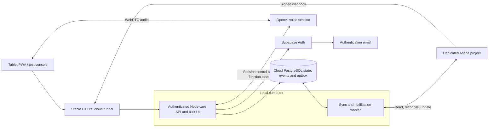

# Architecture and cost research

**October 3 supersession:** The [current product decisions](PRODUCT_DECISIONS_2026-10-03.md) choose initial data hosting on this machine and GPT-6 Sol high reasoning with a separate speech layer. Supabase cloud and a Realtime-only reasoning backend below are historical research choices, not current provisioning requirements. Qualify local PostgreSQL/auth and actual voice connectivity within S01; preserve the $50/month service limit excluding GPT.

Research snapshot: 2026-09-28. Background rationale and provider references; account capabilities remain to be verified during implementation. [The machine-readable roadmap](../roadmap/roadmap.json) is authoritative for feature order, status and completion requirements. This document does not authorize provisioning or establish live-test results.

## Recommended technical choices

These are selections for the initial build, subject to the specific acceptance experiments below. Avoid an open-ended platform comparison. Change a selection when measured evidence or a stated requirement disqualifies it.

| Area | Initial selection | Reason and alternative considered | Evidence required before commitment |
|---|---|---|---|
| Tablet and administrator UI | React + TypeScript, built with Vite; installable PWA; one application with permission-scoped routes | A private interactive application does not currently need server rendering. Next.js is viable, but adds no necessary capability to the first connection test. Native mobile remains an option if the target device fails essential PWA requirements. | Install, sign-in, microphone permission, playback, suspend/resume and refresh on the actual tablet. [Vite](https://vite.dev/guide/); [Next.js PWA alternative](https://nextjs.org/docs/app/guides/progressive-web-apps). |
| Database and identity | Supabase Free managed PostgreSQL + Auth for initial live testing; SQL migrations; explicit grants and row policies | Relational plans, protocol versions, permissions and scores fit PostgreSQL. Start on Free; a later paid plan must solve an observed capacity/reliability need and fit the complete budget. Firebase is a credible offline-oriented alternative, but its client synchronization does not replace the server-owned action ledger we need. | Transaction rollback, uniqueness, authorized/denied access, free-project eligibility, backup restore and inactivity-pause recovery. [Supabase RLS](https://supabase.com/docs/guides/database/postgres/row-level-security); [Firestore offline support](https://firebase.google.com/docs/firestore/manage-data/enable-offline). |
| Application service | Node.js + TypeScript + Fastify, serving the built UI and typed care endpoints | One service owns policy, provider adapters and voice tool execution. Keep modules in one repository; separate services by operational need rather than by each domain object. | Authenticated command round trip, request limits, webhook raw-body verification, health checks and deployment restart. [Fastify](https://fastify.dev/docs/latest/Reference/Server/). |
| Background processing | Separate Node worker, PostgreSQL transactional outbox and leased jobs | Activity change and outbound intent commit together. PostgreSQL is sufficient for the initial volume; no Redis or external workflow platform is required initially. | Worker crash/restart, expired lease recovery, bounded retry, concurrent claims and poison-job visibility. This is an engineering design choice, not a claim of exactly-once external delivery. |
| Initial application hosting | Existing local computer runs the Node web/API process and a separate worker; live PostgreSQL/Auth remain in Supabase | Enables live integration tests and direct debugging before paying for cloud application compute. Use a reproducible build and environment configuration so these processes can later move to hosted compute. A separate local database can support synthetic tests. | Test actual hardware/runtime, process restart, power/sleep behavior, database connectivity and latency; identify who keeps the computer available during a test. |
| Public HTTPS routing | Named Cloudflare Tunnel on the free plan with a stable hostname; reuse an existing suitable domain if available; ngrok is the setup alternative only if its needed features fit a free plan | Allows the tablet and Asana to reach the local API without router port forwarding. A stable hostname avoids changing webhook and OAuth callback registrations after restarts. This routing layer does not run the application or replace its authentication. | HTTPS access, webhook/OAuth flow, allowed origins, tunnel restart, caching and actual account/plan eligibility. Do not add paid routing or Access features by default. [Cloudflare setup](https://developers.cloudflare.com/tunnel/get-started/); [ngrok](https://ngrok.com/docs/start). |
| Later always-on hosting | Retain local compute by default; consider managed compute only when a measured operational need justifies its total cost | Render and Fly.io remain alternatives, not planned subscriptions. Reuse the same code and database if hosting changes. | Availability/recovery targets and an operator are agreed before daily reliance; any hosted option must fit inside the $50 total after other services, tax and conversion. [Render workers](https://render.com/docs/background-workers); [Render WebSockets](https://render.com/docs/websocket). |
| Household integration | Asana Personal free tier; direct REST API, scoped OAuth, dedicated integration identity and explicit project allowlist | Direct code keeps synchronization state and failure handling in the care service. Keep paid Asana features out of the initial dependency list. A PAT is acceptable only for a short operator probe; it does not validate OAuth. | Confirm two-user arrangement, account/plan API capability, consent, token refresh, webhook signature, membership, task read/write and reconciliation. [Asana OAuth](https://developers.asana.com/docs/oauth). |
| Voice | OpenAI Realtime over WebRTC, short user-initiated sessions; application-owned function tools executed on the server | Fits brief conversational commands with spoken replies. A transcription → text tools → speech pipeline is the fallback if device usability, inspectability or cost wins in testing. Full-duplex GPT-Live is a later option if continuous conversation becomes a requirement. | Live tablet speech, clarification, cancellation, tool correctness, disconnect behavior and measured cost. Select and record the available model/version through this experiment. [Voice architectures](https://developers.openai.com/api/docs/guides/voice-agents). |
| Authentication email | Resend Free SMTP connected to Supabase, unless an existing suitable SMTP service has no incremental cost | Invitation and account recovery must work for family accounts. Supabase's default sender is restricted and is not a production email solution. | Sender verification, invite/recovery delivery and free quotas; rate-limit routine messages so they do not exhaust account recovery capacity. [Supabase SMTP](https://supabase.com/docs/guides/auth/auth-smtp); [Resend setup](https://resend.com/docs/send-with-supabase-smtp). |
| Notifications | Database-backed in-app notifications first; add one consented external channel after the device test | Keeps the MVP usable while delivery preferences are confirmed. Email is the provisional external choice because an SMTP service is already needed; messages contain a generic prompt and a secure link. | Correct recipient, revocation, quiet hours, acknowledgement and duplicate suppression. Push eligibility and background behavior are tested on the actual tablet before promising push reminders. |

### Region and cost decision

Resolve processing-region requirements before creating the first retained-data environment. Local execution removes the immediate cloud application-region choice; it does not remove the tunnel provider, database, email, Asana or AI from the data flow. Supabase offers Canada Central. For a later move to cloud compute, Render's listed regions do not include Canada; Fly.io Toronto is an alternative to evaluate. Confirm the location and handling of proxy traffic, logs, backups and provider processing individually. [Supabase regions](https://supabase.com/docs/guides/platform/regions), [Render regions](https://render.com/docs/regions), [Fly.io regions](https://docs.fly.io/reference/regions/).

OpenAI documents Canadian regional storage without Canadian regional inference, with eligibility requirements for regional controls. Do not assume a Canada-hosted application means all voice processing stays in Canada. Record which endpoints, retention settings and account controls are actually available before sending care details. This is a technical deployment constraint, not a legal compliance determination. [OpenAI data controls](https://developers.openai.com/api/docs/guides/your-data).

### Cost plan: free services first, $50/month maximum

Prices checked on 2026-09-28. This is a proposed bill of services, not a claim that accounts have been provisioned. Confirm account eligibility, quotas, renewal terms and checkout prices during setup.

| Service | Initial plan | Incremental monthly service cost | Constraint |
|---|---|---|---|
| Application/API and worker | Existing local computer | $0 cloud-compute subscription | Existing hardware/internet assumed; record any additional connectivity or power expense separately rather than calling local operation costless. |
| PostgreSQL and authentication | Supabase Free | $0 | 500 MB database and 5 GB egress; free-project eligibility depends on the account's existing quota. Use local synthetic databases to avoid extra cloud instances. |
| HTTPS routing | Cloudflare Tunnel with free-plan features | $0 tunnel subscription | A stable hostname needs a suitable domain; avoid paid routing, load balancing and security add-ons. |
| Household tasks | Asana Personal | $0 | Up to two users; household manager plus dedicated integration identity. Participant/family app users need not each have Asana seats. Verify the chosen API flow on this plan. |
| Authentication/notification email | Resend Free | $0 | Current quota: 3,000 emails/month and 100/day; verify sender domain. Prefer in-app routine notifications. |
| Domain | Existing suitable domain/subdomain first | $0 incremental if already available; otherwise quote required | Record registration, renewal, tax and payment timing. An annual payment is not a monthly charge; show both the normalized monthly cost and the actual month it is billed. |
| Backups and operational logs | Encrypted exports, bounded local logs and existing appropriate backup storage first | $0 additional subscription if suitable storage already exists; otherwise quote required | Test restoration; maintain a separately located copy and keep private data out of GitHub. No paid observability subscription by default. |
| GPT backend usage | Separately metered | Excluded from the $50 service ceiling | Track this separately. Other service charges are not exempt merely because they support an AI feature. |

The selected free-service subscription subtotal is **$0/month**, before any new domain, backup destination or other incremental operating expense. Aim to keep the early test environment below **CAD $10/month** if existing resources permit; this is a design target, not a vendor quote. For an established pilot, aim for at most **$40/month** in the confirmed budget currency and retain **$10/month** of headroom. The hard ceiling remains **$50/month**, including tax and conversion/fees. Do not assume an unpriced item is free or that annual billing fits the cash budget merely because its monthly equivalent is small.

Sources: [Supabase pricing](https://supabase.com/pricing), [Cloudflare free plan](https://www.cloudflare.com/plans/zero-trust-services/) and [Tunnel availability](https://developers.cloudflare.com/tunnel/), [Asana Personal](https://asana.com/plan/personal), [Resend pricing](https://resend.com/pricing).

**Free database tradeoff:** Supabase Free can pause after low activity over seven days. Its paid daily-backup offering is not included in this choice; schedule encrypted exports of required data and verify a restore before retaining meaningful household records. Document the scope of each export, including whether identity data or files require a separate recovery procedure. Before daily care reliance, assess whether free-tier availability and this backup procedure meet the agreed needs. [Project pausing](https://supabase.com/docs/guides/platform/free-project-pausing), [backups](https://supabase.com/docs/guides/platform/backups).

If a paid database is justified, Supabase Pro starts at **US$25/month** for the first included project. Calculate the actual total in the confirmed budget currency, including tax, exchange/card fees and all other services, before selecting it. Additional paid projects start at US$10/month, so a second paid test database must not appear by accident. Prefer local synthetic tests and an eligible separate free integration project. A paid plan is an option, not a scheduled upgrade. [Supabase pricing](https://supabase.com/pricing), [organization billing](https://supabase.com/docs/guides/platform/billing-on-supabase).

Cost controls to implement during setup:

- Keep a service ledger with plan, billing currency, quotas, renewal dates, current monthly total and worst expected bill. Recheck it whenever proposing a paid feature, a new project or a seat.
- Avoid expiring paid trials as core dependencies. Leave automatic paid upgrades and optional usage-based extras disabled where the provider allows it. A quota failure must be visible and recoverable, not silently trigger a purchase.
- Use provider quota alerts and caps where available. Verify their scope: Supabase's Pro spend cap does not cover compute and several add-ons, so it is not an account-wide $50 guardrail. [Supabase cost controls](https://supabase.com/docs/guides/platform/cost-control).
- Avoid paid SMS, separate workflow/queue platforms, Redis, premium analytics, dedicated database domains, preview database branches and paid log drains initially. Use the local worker, PostgreSQL outbox, in-app notifications and bounded operational logs already in the design.
- Bound reconciliation frequency, retries, notification volume and retained diagnostic data. Do not prune required care history to stay in a free tier; revisit storage design or the service allocation if capacity approaches its limit.
- Escalate any forecast above $40 while there is still room to adjust. A change that would exceed $50 requires an explicit budget revision; the implementation must otherwise stay within the cap. These are implementation requirements, not an already-running billing monitor.

## Local application with cloud routing

The cloud tunnel routes incoming HTTPS requests to the local service. The local API and worker make their own outgoing authenticated connections to Supabase and Asana; these do not require an inbound tunnel. Keep the live cloud database as the operational source of truth and use a separate disposable local database for synthetic development. Local application execution does not imply local AI inference.

Cloudflare Tunnel uses an outbound connection from the computer and maps a hostname to a local service. Named tunnels require the appropriate domain/account setup. Temporary Quick Tunnels generate random hostnames and have testing limitations, so use them only for a disposable first probe. [Tunnel architecture](https://developers.cloudflare.com/tunnel/), [setup and Quick Tunnel limits](https://developers.cloudflare.com/tunnel/get-started/).

Implementation requirements for the first routed test:

- Expose the intended application port only; bind it to loopback where the tunnel connector runs on the same host. Serve the built UI for live household testing. Keep debug ports, database administration and unrestricted development tooling private.
- Retain application authentication and resource permissions. A public tunnel URL is reachable by others; it is not an access policy. If a human login gate is added at the proxy, the webhook route must remain callable by Asana and verify its handshake/signature in the application. Test the OAuth callback through the actual routing policy.
- Register the stable HTTPS origins and exact callback URLs with Asana and Supabase. Bypass proxy/browser caches for authenticated API responses and care data; inspect forwarded headers and configure trust only for the known proxy path.
- Treat tunnel request inspection, logs and TLS termination as part of the provider data flow. Avoid capturing real task bodies or audio in debugging tools by default.
- Run supervised early sessions with the computer awake. Then test tunnel restart, application restart and a full computer/network interruption. The tunnel does not provide durable webhook buffering or execute jobs when the computer is offline.

If the computer is unavailable, already committed database records and outbox jobs remain in the cloud, but this architecture cannot accept new application writes or execute queued work. Reconcile missed Asana changes after recovery. A later cloud webhook receiver with a durable inbox could accept notifications during local outages, but requires its own authentication, signature validation and idempotency; add it only if that availability requirement emerges.

Before routine daily reliance, choose either maintained local hosting with startup supervision, agreed sleep/update policy, monitoring and suitable power/network recovery, or hosted application compute. A cloud move uses the same API, worker and schema: migrate configuration, change routing/callback registrations as needed, drain or lease jobs safely, and repeat the live acceptance tests. Cloud routing by itself does not make the local backend highly available.

The API creates an authenticated voice session, binds it to the user's identity and uses a server-side control connection for tools. Voice and touch invoke the same application command handler. Asana credentials, privileged database credentials and standard OpenAI API keys stay on servers. A browser session uses short-lived credentials; speech output acknowledges only the state returned by the application. [Realtime browser flow](https://developers.openai.com/api/docs/guides/realtime), [server-side controls](https://developers.openai.com/api/docs/guides/voice-server-controls).
